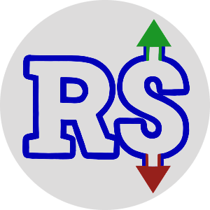

# Engenharia de Software-2025.1 - Universidade Federal do Tocantins - Palmas

### **Curso**: Bacharelado em Ciência da Computação
### **Professor**: Edeilson Milhomem da Silva

## Descrição :
O objetivo da disciplina foi propor que cada grupo desenvolvesse um projeto web com tema de livre escolha, tendo como foco a aplicação prática das tecnologias HTML, CSS e JavaScript no front-end, e PHP no back-end. No que diz respeito ao versionamento de código, foram utilizadas ferramentas como Git, GitFlow e GitHub.

Além disso, metodologias ágeis estudadas ao longo da disciplina também deveriam ser incorporadas ao fluxo de trabalho do projeto. Dentre elas, destacam-se o Product Backlog, a Sprint Planning e o Daily Scrum, que contribuíram para uma organização mais eficiente das tarefas e para o desenvolvimento colaborativo entre os membros da equipe.

## Grupos:

### Grupo 1:

#### BiblioTech

 |<h2><a href="https://bibliotech-1067371253069.southamerica-east1.run.app/">Bibliotech</a></h2>  O BiblioTech é uma livraria digital que permite a venda de livros digitais (ebooks) de forma acessível e organizada. Os usuários poderão explorar um catálogo de livros, realizar compras e acessar sua biblioteca digital para leitura dos ebooks adquiridos.| |
| ------------------------------------------------------------ | ---------------------------------------------------------------------------------------------------------------------------------------------------------------------------------------------------------------------------------------------------------------------------------------------------- |

## Tecnologias Utilizadas:

- **PHP:** Backend da Aplicacação (Server side).
- **HTML:** Estruturação do conteúdo e das páginas.
- **CSS:** Estilização das páginas.
- **JavaScript:** Manipulação do DOM e requisições para o lado do servidor (Client side).
- **Git:** Controle de versão do código.
- **PostgreSQL:** Banco de dados. 

#### Equipe
| Nome | Github |
| ------------------------- | ------------------------------------------ |
| Guilherme Thomaz | [@thomazllr](https://github.com/thomazllr) |
| Ítalo Reis | [@italohreis](https://github.com/italohreis) |
| Marcos Freire | [@MarcosFrMelo](https://github.com/MarcosFrMelo) |
| Jhennifer da Silva | [@jhenisushi](https://github.com/jhenisushi) |
| Luiz Felipe da paz leal | [@Luiz Felipe](https://github.com/arkfx) |

#### Repositório:
| Links Uteis                                                                                |
|------------------------------------------------------------------------------------------- |
| [BiblioTech - Ir ao Repositório](https://github.com/thomazllr/bibliotech)     |
| [Landing Page](https://thomazllr.github.io/bibliotech/) |
| [Versão Final](https://github.com/thomazllr/bibliotech/releases/tag/v5.0.0) |
| [Vídeo do produto](https://youtu.be/jdrw7Boz4Xs?feature=shared) | 
| [Apresentação Final](https://github.com/thomazllr/bibliotech/blob/main/relatorios/apresentacao-final_bibliotech.pdf) |

### Grupo 2: 

#### FinPlan
 |<h2>FinPlan</h2> 
O FinPlan é uma plataforma online de gestão financeira pessoal desenvolvida para auxiliar usuários no controle das suas finanças de forma simples e eficiente. O sistema permite o cadastro de receitas e despesas, categorização de transações, visualização de relatórios e gráficos interativos gerados automaticamente baseado nas inserções do usuario.  A ferramenta foi pensada para quem deseja organizar o orçamento mensal, acompanhar investimentos e alcançar metas financeiras com clareza e praticidade.
 <a href="https://sidydev-ai.github.io/FinPlan-LandingPage/">Landing page</a> 

 <a href="https://youtu.be/JFuamshfgn4?si=Y5ahFiLEvEaJ3IHQ">Vídeo</a> 

 <a href="https://github.com/SidyDev-AI/finplan/releases/tag/v5.1.0">Versão Final</a> 

 <a href="slides/finplan/Apresentação Final de Engenharia de Software.pptx">Apresentação Final</a>  | |
| ------------------------------------------------------------ | ---------------------------------------------------------------------------------------------------------------------------------------------------------------------------------------------------------------------------------------------------------------------------------------------------- |
-------

#### Equipe
| Nome | Github |
| ------------------------- | ------------------------------------------ |
| José Borges Costa | [@SidyDev-AI](https://github.com/SidyDev-AI) |
| Lucas Carvalho da Luz Moura | [@luc4sm0ur4](https://github.com/luc4sm0ur4) |
| Kawan de Sá | [@Kawannawak](https://github.com/Kawannawak) |
| [Link para repositório do projeto](https://github.com/SidyDev-AI/finplan) |

---

### Grupo 3:
| | <h2><a href="https://github.com/DevThiagoGalvaoAmorim/Do-it">Do it</a></h2>  Este é um aplicativo de gerenciamento de tarefas que ajuda você a organizar, acompanhar e concluir suas tarefas com eficiência! |
| ------------------------------------------------------------ | ---------------------------------------------------------------------------------------------------------------------------------------------------------------------------------------------------------------------------------------------------------------------------------------------------- |

#### Equipe
| Nome | Github |
| ------------------------- | ------------------------------------------ |
| Thiago Galvão Amorim | [@DevThiagoGalvaoAmorim](https://github.com/DevThiagoGalvaoAmorim) |
| Douglas Alves da Cruz | [@douglasalvesc](https://github.com/douglasalvesc) |
| Ruam Marcos Maciel dos Santos | [@RuamMarcos](https://github.com/RuamMarcos) |
| João Sestari Galvão | [@joaosgalvao](https://github.com/joaosgalvao) |
| Raphael Sales de Souza | [@raphaelsales](https://github.com/raphaelsales) |
| Guilherme da Silva Carvalho | [@guilherme1737](https://github.com/guilherme1737) |

#### Repositório:
| Links Uteis                                                                                |
|------------------------------------------------------------------------------------------- |
| [Do it- Ir ao Repositório](https://github.com/DevThiagoGalvaoAmorim/Do-it.git)     |
| [Landing Page]() |
| [Versão Final]() |
| [Vídeo do produto]() | 
| [Apresentação Final]() |

---

### Grupo 4: 
#### Gyga-fit
O Gyga Fit é uma solução digital desenvolvida para otimizar a experiência dos alunos de academias, oferecendo um sistema online acessível por meio de um site. O projeto visa proporcionar praticidade no acesso aos serviços da academia, permitindo que os usuários se cadastrem, solicitem planos de treino personalizados e monitorem seu desempenho de forma intuitiva.

Além disso, o sistema também contempla o uso por professores, que podem cadastrar e gerenciar planos de treino para os alunos. O Gyga Fit conta ainda com uma estrutura de administração mais ampla, permitindo que um administrador geral gerencie múltiplas academias (firmas) e controle o acesso de gerentes responsáveis por unidades específicas.

A plataforma conta com login seguro, área de monitoramento, e funcionalidades voltadas tanto para o público aluno quanto para a equipe da academia, tornando a gestão mais eficiente e completa.

#### Equipe
| Nome | Github |
| ------------------------- | ------------------------------------------ |
| João Hott | (https://github.com/HottBraz) |
| Hallef Kayk | (https://github.com/HallefKayK) |
| samuel Andrade Luz Carneiro |(https://github.com/Samuel1-salc) |
| Sophia Ribeiro prado  | (https://github.com/sophiaprado1) |
| Heitor Fernades | (https://github.com/HeitorFernandes04) |
| Mauricio Monteiro | (https://github.com/MontDeP) |
| [Link para repositório do projeto](https://github.com/Samuel1-salc/Gyga-fit-gym.git) |

---

### Grupo 5: 

|  | <h2><a href="https://github.com/lfocarvalho/engenhariadesoftware">Daily Planner</a></h2>   O Daily Planner é uma aplicação de agenda pessoal online, inspirada em ferramentas como o Notion, mas com foco em simplicidade e objetividade. O projeto permite que os usuários gerenciem tarefas, organizem suas atividades diárias e acompanhem sua produtividade através de uma interface limpa e responsiva. Este projeto foi desenvolvido como parte da disciplina de Engenharia de Software da Universidade Federal do Tocantins. |
| :----------------------------------------------------------- | :------------------------------------------------------------------------------------------------------------------------------------------------------------------------------------------------------------------------------------------------------------------------------------------------------------------------------------------------------------------------------------------------------------------------------------------------------------------------------------------------------------------------------------------- |

## Tecnologias Utilizadas:

  - **Backend:** PHP 7.4+ para toda a lógica da aplicação.
  - **Banco de Dados:** MySQL com interação via PDO para prevenção de SQL Injection.
  - **Frontend:** HTML5, CSS3 (com Flexbox e Grid) e JavaScript puro.
  - **Bibliotecas:** Chart.js para gráficos de produtividade e PHPMailer para o serviço de e-mails.
  - **API:** API RESTful para serviços desacoplados, como envio de e-mails, com autenticação via API Key.
  - **Gerenciador de Dependências:** Composer para a API.
  - **Testes:** PHPUnit para testes unitários da lógica de negócios.
  - **Controle de Versão:** Git e GitHub.
  - **DevOps:** Shell Script para automação da configuração do banco de dados.

## Componentes do Projeto:

| Nome                               | GitHub                                                     |
| :--------------------------------- | :--------------------------------------------------------- |
| Isabela Barros de Oliveira.        | [@Isabelabarros-o](https://github.com/isabelabarros-o)       |
| Letícia Gomes Lopes.               | [@LeticiaGLopes-151](https://github.com/LeticiaGLopes-151)   |
| Luiz Fernando De Oliveira Carvalho | [@Lfocarvalho](https://github.com/lfocarvalho)             |
| Mateus Leopoldo Santiago da Silva  | [@MateusLeopoldo](https://github.com/MateusLeopoldo)       |
| Natália Morais Nerys.              | [@natalia-nerys](https://github.com/natalia-nerys)         |
| Ranor Victor dos Santos Araújo.    | [@ranorvictor](https://github.com/ranorvictor)             |

## Repositório:

| Links Úteis                                                                                                                |
| :------------------------------------------------------------------------------------------------------------------------- |
| [Daily Planner - Ir ao Repositório](https://github.com/lfocarvalho/engenhariadesoftware)                                   |
| [Landing Page](https://)                                                            |
| [Versão Final](https://)           |
| [Video do Produto](https://)           |
| [Apresentação Final](https://www.canva.com/design/DAGryiWg8vs/1biOXCbjtC6qSIbNcjb1kw/view?utm_content=DAGryiWg8vs&utm_campaign=designshare&utm_medium=link2&utm_source=uniquelinks&utlId=hc76e07b93f)           |

---

### Grupo 6:

#### NutriCalc

NutriCalc é uma aplicação web desenvolvida com PHP, HTML e CSS, com o objetivo de facilitar o controle e acompanhamento de informações nutricionais.

#### Equipe

Nome | Github  
--- | ---    
[Afonso Dglan](https://github.com/AfonsoDglan) | [@AfonsoDglan](https://github.com/AfonsoDglan)
[Caio Gonçalves Nascimento](https://github.com/caiogn-dev) | [@caiogn-dev](https://github.com/caiogn-dev)  
[Carlos Ribeiro](https://github.com/caiogn-dev) | [@CarlosRibeiro-CERL](https://github.com/CarlosRibeiro-CERL)  
[Jonata Rubens](https://github.com/JonataRubens) | [@JonataRubens](https://github.com/JonataRubens)
[Marcus Vinícius](https://github.com/Galessss) | [@Galessss](https://github.com/Galessss)

 

#### Link para o Repositório do Projeto

[Repositório](https://github.com/JonataRubens/NutriCalc.git)

---

